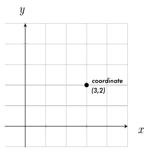
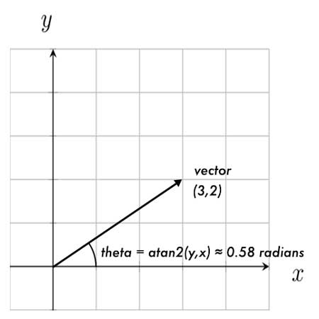

# ComputerGraphics2021

MEDIART 206: Computer Graphics - openFrameworks
    
Fall Session 2 2021  

Week 02 - Class 03

## Notes

[oFBook Code Examples GitHub](https://github.com/openframeworks/ofBook/tree/master/chapters)

## Issues, Bugs and Fixes

If you encounter errors with ofAppGlutWindow.h:

```
#include "ofMain.h"
#include "ofApp.h"
#include "ofAppGlutWindow.h"
 
//========================================================================
int main( ){
 
    ofAppGlutWindow window;
         ofSetupOpenGL(&window, 1024,768, OF_WINDOW);                    // <-------- setup the GL context
 
         // this kicks off the running of my app
         // can be OF_WINDOW or OF_FULLSCREEN
         // pass in width and height too:
         ofRunApp( new ofApp());
}
``` 

Modify the code to  this:

```
#include "ofMain.h"
#include "ofApp.h"
 
//========================================================================
int main( ){
         ofSetupOpenGL(1024,768, OF_WINDOW);                   // <-------- setup the GL context
 
         // this kicks off the running of my app
         // can be OF_WINDOW or OF_FULLSCREEN
         // pass in width and height too:
         ofRunApp( new ofApp());
}
 "
 ```
 
Newer versions of oF and macOS break some of the older code.

## Code Examples in Class

- **BouncingBall** adding acceleration (gravity) to the old Bouncing Ball example
- **Zeno** illustration of interpolation and "Zeno" easing technique
- **MultiZeno** using ofMap to create a multicolor worm that follows the mouse
- **Atan2** - calculate angle of motion using `atan2(vec.y,vec.x)`
- **Followers** - use atan2 to create an animated arrow
- **Mass** - bouncing balls using `Force = Mass x Acceleration`
- **NoiseGrid** - create a grid to draw noise as color over space and time
- **NoisyFollowers** - create a swarm of followers with noise-based positions
- **Oscillators** - drawing [Lissajous](https://en.wikipedia.org/wiki/Lissajous_curve)-like curves using `sin()` and `cos()`
- **SignalPlot** - plot `sin()`, modulating amplitude and frequency over time


## Review

### Vectors - ofVec2f

In math, a vector is a position in 2D (or 3D, 4D...) coordinates.  
In openFrameworks, we use the class __ofVec2f__ to describe a 2D vector.

You can think of a vector as a position in space -  
**or** as an arrow pointing from the origin _(0,0)_ to that position _(x,y)_.  
This arrow represents a _direction_ (angle of arrow) and a _magnitude_ (length of arrow).



We can do lots of useful things with vectors, like adding, subtracting and multiplying (scaling) them:

```c++
ofVec2f addVec = ofVec2f(3,2) + ofVec2f(1,1); // == ofVec2f(4,3)

ofVec2f scaleVec = ofVec2f(3,2) * 2.; // == ofVec2f(6,4)
```

In class, we'll use `ofVec2f` to represent both positions and movement in space.

### Interpolation

Interpolation is a like a smooth transition from one value to another.   
It's a very handy concept for creating animations.

We can use interpolation to smoothly move things, scale things, change colors, etc.

The magic basic interpolation formula is:  

`C = A * (1-percent) + B * (percent)`

(where `percent` is the amount of interpolation between A and B)

Think of it like this:   
We start at A, and want to "travel" some percentage of the distance to B.   
The distance is `(B - A)`, so the formula above could also be written: `C = A + (B - A) * pct`

As an example, to interpolate 25% from 2.0 to 4.0:

```c++
float A = 2.;
float B = 4.;
float pct = 0.25;
float C = A * (1.-pct) + B * pct; 
//    C = 2 * (.75)    + 4 * (.25)
//    C = 2.5
```

#### ofMap()

OpenFrameworks includes a nice function for interpolation, [`ofMap()`](http://openframeworks.cc/documentation/math/ofMath/#!show_ofMap).  
`ofMap` simply maps a value from one range to another.

For instance, we could map:  
the mouse X value on the screen `(0 - ofGetWidth())` to a brightness value `(0 - 255)`:

```c++
int brightness = ofMap(ofGetMouseX(), 0, ofGetWidth(), 0, 255);
// if mouse is halfway across the screen, brightness == 122
```

#### Zeno

The "Zeno" formula is based on [Zeno's paradox](https://en.wikipedia.org/wiki/Zeno%27s_paradoxes#Dichotomy_paradox):  

> Imagine you are in a room, and you are walking to a door - but with each step you take, you move exactly half the distance between yourself and the door.  
> 
> As you approach the door, each step will be half as large as the last. You will walk more and more slowly towards the door, never quite reaching it.

This is a method of interpolation we call **easing**. It is a dynamic interpolation over time.  It's one way of quickly modelling acceleration or deceleration.

In oF, we could implement it this way:

```c++
// ease ball position towards mouse using `Zeno` interpolation

void update(){
    // every frame, we will move a ball 10% of the way to a target
    
    float pct = 0.1; 
    ofVec2f target;
    target.x = ofGetMouseX(); // our target will be the mouse pos
    target.y = ofGetMouseY();
    
    // interpolation
    ball.position = ball.position * (1.-pct) + target * (pct);
}
```

### Movement and Force

We use vectors to represent both position, and movement, or _velocity_.  
Here's how we might use velocity to change position over time. 

```c++
ofVec2f position = ofVec2f(1,1); // start at (1,1)
ofVec2f velocity = ofVec2f(1,2); // move 1 along X axis, 2 along Y axis

void update() { 
    position += velocity;  // update position by adding velocity
    // velocity: (1,2)    (1,2)    (1,2)
    // position: (1,1) -> (2,3) -> (3,5), etc.
}
```

When a **force** is applied to an object in motion, it changes the velocity of the object.  
This is called **acceleration**, which we can also represent with an `ofVec2f`:

```c++
// create a downward acceleration force

ofVec2f pos = ofVec2f(1,1);
ofVec2f vel = ofVec2f(1,2);
ofVec2f acc = ofVec2f(0,1); // adjust velocity by (0,1) each frame

void update() { 
    vel += acc;    // update velocity by acceleration
    pos += vel;    // update position by velocity

    //           frame 0   frame 1  frame 2
    //           -------   -------  -------
    // accel   : (0,1)     (0,1)    (0,1)
    // velocity: (1,2) --> (1,3) -> (1,4) -> etc.
    // position: (1,1) --> (2,4) -> (3,8) -> etc.
}
```


### `ofNoise()`: Order in Chaos

**Noise** is a way of **smoothly randomizing** things.  
You can think of "noise" as a cloudy space, full of values ranging from 0.0 to 1.0.

You can access these values by inputting a set of coordinates in 1D, 2D, or 3D:

```c++
ofVec3f coords = ofVec3f(x,y,z);  // 3D noise
float noiseVal = ofNoise(coords); // returns 0.0 - 1.0
```

Under the hood, `ofNoise()` uses [Perlin noise](https://thebookofshaders.com/11/), a special noise function originally developed by Ken Perlin for CGI animation in the 1982 film _Tron_ (he won an Oscar for it!).


### Oscillation: `sin()` and `cos()`

When we want to model oscillating motion, we often use the C++ sine and cosine functions:  

```c++
float sine = sin(theta);
float cosine = cos(theta);
// theta is a float in radians, which wrap around at 0 and 2*PI (0º - 360º)
```

As `theta` increases, the return values smoothly oscillate between -1.0 and 1.0.  
In the diagram below, `theta` is shown in yellow.  


Note that the cosine wave is just the sine wave with an offset.

### Rotation: `atan2` (arctangent)

Recall that a vector has both a direction (angle of vector) and a magnitude (length of vector).  
We can calculate the angle of a vector using the C++ `atan2(y,x)` function:

```c++
ofVec2f vec = ofVec2f(3,2);
float angleRadians = atan2(vec.y, vec.x);   // note that y comes before x!
```


This allows us to model the angular rotation of objects, given a direction vector:

```c++
ofVec2f velocity = ofVec2f(3,2);    // our direction
float radians = atan2(velocity.x, velocity.y);     // direction angle
ofRotate(ofRadToDeg(rotation));     // ofRotate() takes angle in degrees
```

## Homework

### Reading

1. **Read chapters in ofBook**
    - [Graphics](http://openframeworks.cc/ofBook/chapters/intro_to_graphics.html)
    - [Animation](http://openframeworks.cc/ofBook/chapters/animation.html)   
    - [Simulation](http://openframeworks.cc/ofBook/chapters/animation.html#simulation)

2. **Read: Chapter 2 - The Nature of Code**
    - [Book](http://natureofcode.com/book/chapter-2-forces/)

3. **Watch: The Nature of Code - Chapter 2 Videos**
    - [Videos](https://www.youtube.com/watch?v=II1A3bBo6gM&list=PLRqwX-V7Uu6ZRrqLcQ5BkBKmBLiGD8n4O)

### Code Sketches

1. **Windy**  
    Create a scene with multiple moving objects, like the old Bouncing Ball example.  Add a "wind" force that pushes your objects around the scene.  Now add multiple winds that change over time!

2. **Moving Portrait**  
    Create a "self-portrait" using shapes and colors.  Use interpolation to animate the shapes in some way - perhaps the color changes over time, or in response to mouse movement... Get creative!

3.  **Act Natural**

    For this sketch, you will create an animation that mimics some natural motion.  
    
    **First, choose your movement:**
    
    Observe the motion of the world around you - notice leaves blowing in the wind, or a cat wagging its tail. Find or shoot a quick video of the motion you want to simulate for reference.  On paper, draw the course of the motion over time.
    
    [Watch this short video for reference/inspiration.](https://www.youtube.com/watch?v=yzJk6ww3LD0)  
    
    **Then, model the motion in code:**
      
    In oF, create a scene, and animate an object or shape (or a group of them!) based on your motion.
    
    To achieve the animation, you should use functions like `sin()`, `cos()`, `ofNoise()`, `atan2()`, interpolation, `ofGetElapsedTimef()`, or other techniques of your choosing.  
    (Check out [Robert Penner](http://robertpenner.com/easing/)'s or [Golan Levin](http://www.flong.com/texts/code/shapers_exp/)'s [easing equations](http://easings.net/) for many more.)
      
    It may help to break down your motion into elements:
    
    - Are there aspects of the motion that oscillate (repeat) and aspects that don't?  
    `sin()` is a good choice for modelling the oscillating parts (`ball.x = sin(time)`)
     
    - Or maybe there are parts that are regular and predicatable, and parts that are more random?  
    `ofNoise()` is a good choice for random-ish behavior.
    
    **Make it interactive:**  
    Add an element of interactivity:  
    Perhaps mouse position affects the speed, or mouse click restarts the animation... get creative!

4. Don't forget to **push** your sketches to your homework repo on GitHub.

